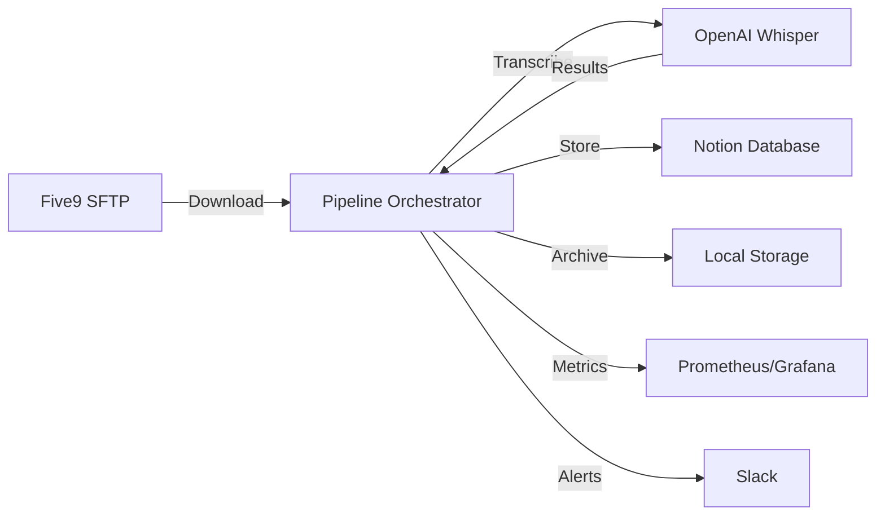

# Five9 Enterprise Recording Pipeline

> Production-grade TypeScript service for automating Five9 call recording transcription with OpenAI Whisper and Notion integration.

## Operational Reality (Do Not Assume Otherwise)
- Droplet was rebuilt. Old local disk data is gone.
- Files are local on the droplet; ingestion uses rsync (not remote SFTP).
- Source path: `/five9sftp/upload/SB CS/<MM_DD_YYYY>/`
- Destination path: `/srv/five9/incoming/`
- Systemd timer runs the `ingest.sh` workflow.

## 🎯 Overview

This service automatically:
1. Connects to Five9 SFTP server via SSH2
2. Downloads call recording files (.wav, .mp3, .m4a, .flac)
3. Transcribes them using OpenAI Whisper API
4. Stores results in Notion database
5. Archives processed files locally
6. Provides monitoring and health checks

## 🏗️ Architecture



## ✨ Features

- 🔒 **Type-Safe**: Built with TypeScript in strict mode
- 🛡️ **Robust**: Comprehensive error handling and retry logic
- 📊 **Observable**: Structured logging with Pino + Prometheus metrics
- ✅ **Validated**: Zod-based configuration validation
- 🐳 **Containerized**: Docker support with multi-stage builds
- 🧪 **Tested**: Unit and integration tests with Jest
- 🔄 **Resilient**: Graceful shutdown and state recovery
- 📈 **Scalable**: Batch processing with concurrency limits

## 🚀 Quick Start

### Prerequisites

- Node.js >= 20.0.0
- npm >= 10.0.0
- Docker (optional, for containerized deployment)

### Installation

```bash
# Clone the repository
git clone <repository-url>
cd five9-enterprise-pipeline

# Install dependencies
npm install

# Copy environment template
cp .env.example .env

# Edit .env with your credentials
nano .env
```

### Configuration

Edit `.env` file with your credentials:

```env
# SFTP Configuration
SFTP_HOST=your-five9-sftp-host.com
SFTP_USERNAME=your-username
SFTP_PASSWORD=your-password

# OpenAI Configuration
OPENAI_API_KEY=sk-your-api-key

# Notion Configuration
NOTION_API_KEY=secret_your-integration-key
NOTION_DATABASE_ID=your-database-id
```

### Running

```bash
# Development mode (with hot reload)
npm run dev

# Build and run production
npm run build
npm start

# Run with Docker
docker-compose up
```

## ⏱️ Systemd Timer (ingest.sh)

This pipeline can be scheduled via systemd to run the filesystem-based ingest script.

```bash
# Install unit files
sudo cp five9-ingest.service /etc/systemd/system/five9-ingest.service
sudo cp five9-ingest.timer /etc/systemd/system/five9-ingest.timer

# Reload and enable the timer
sudo systemctl daemon-reload
sudo systemctl enable --now five9-ingest.timer
```

### Test now (no need to wait)

```bash
# Run a one-off ingest
sudo systemctl start five9-ingest.service

# Check status
sudo systemctl status five9-ingest.service

# Inspect logs
sudo tail -n 100 /srv/five9/logs/systemd.log
```

### Verify timer schedule

```bash
systemctl list-timers --all | grep five9-ingest
```

## ⏱️ Systemd Timer (SFTP pull + transcription)

If you want a single pipeline where the Node app pulls directly from Five9 SFTP,
use the `five9-transcribe` systemd units. This replaces `ingest.sh` and avoids
duplicate ingest.

```bash
# Install unit files
sudo cp five9-transcribe.service /etc/systemd/system/five9-transcribe.service
sudo cp five9-transcribe.timer /etc/systemd/system/five9-transcribe.timer

# Reload and enable the timer
sudo systemctl daemon-reload
sudo systemctl enable --now five9-transcribe.timer

# Optional: disable the ingest timer to avoid duplicate pulls
sudo systemctl disable --now five9-ingest.timer
```

## 📋 Configuration Reference

| Variable | Description | Default | Required |
|----------|-------------|---------|----------|
| `SFTP_HOST` | Five9 SFTP server hostname | - | ✅ |
| `SFTP_PORT` | SFTP server port | 22 | ❌ |
| `SFTP_USERNAME` | SFTP username | - | ✅ |
| `SFTP_PASSWORD` | SFTP password | - | ✅ |
| `SFTP_REMOTE_PATH` | Remote directory path | /recordings | ❌ |
| `OPENAI_API_KEY` | OpenAI API key | - | ✅ |
| `OPENAI_MODEL` | Whisper model to use | whisper-1 | ❌ |
| `NOTION_API_KEY` | Notion integration key | - | ✅ |
| `NOTION_DATABASE_ID` | Target database ID | - | ✅ |
| `BATCH_SIZE` | Files per batch | 5 | ❌ |
| `MAX_FILE_SIZE` | Max file size (bytes) | 25000000 | ❌ |
| `CONCURRENCY_LIMIT` | Parallel processing limit | 3 | ❌ |

## 🧪 Testing

```bash
# Run all tests
npm test

# Watch mode
npm run test:watch

# Integration tests only
npm run test:integration

# Coverage report
npm test -- --coverage
```

## 🐳 Docker Deployment

```bash
# Build image
npm run docker:build

# Run with docker-compose
docker-compose up -d

# View logs
docker-compose logs -f

# Stop
docker-compose down
```

## 📊 Monitoring

The service exposes the following endpoints:

- `GET /health` - Health check endpoint
- `GET /metrics` - Prometheus metrics
- `GET /ready` - Readiness probe

### Key Metrics

- `files_processed_total` - Total files processed (by status)
- `transcription_duration_seconds` - Transcription latency histogram
- `notion_api_duration_seconds` - Notion API latency histogram
- `active_sftp_connections` - Current SFTP connections
- `pipeline_health` - Overall pipeline health (0/1)

## 🔧 Development

```bash
# Type checking
npm run typecheck

# Linting
npm run lint
npm run lint:fix

# Formatting
npm run format
npm run format:check
```

## 📁 Project Structure

```
five9-enterprise-pipeline/
├── src/
│   ├── config/           # Configuration and validation
│   ├── services/         # Core services (SFTP, Transcription, Notion)
│   ├── pipeline/         # Pipeline orchestrator
│   ├── monitoring/       # Metrics and health checks
│   ├── utils/            # Utilities (logger, errors, filesystem)
│   ├── server.ts         # HTTP server for monitoring
│   └── index.ts          # Entry point
├── tests/
│   ├── unit/            # Unit tests
│   └── integration/     # Integration tests
├── docs/                # Additional documentation
├── scripts/             # Utility scripts
└── data/                # Runtime data directories
```

## 🔍 Troubleshooting

### SFTP Connection Issues

```bash
# Test SFTP connectivity
sftp -P 22 username@your-five9-host.com
```

### OpenAI API Errors

- Ensure API key is valid and has credits
- Check file size limits (25MB max)
- Verify file format is supported

### Notion Integration Issues

- Verify integration has access to database
- Check database schema matches expected format
- Ensure API key has correct permissions

## 📖 Additional Documentation

- [Architecture Details](./docs/ARCHITECTURE.md)
- [API Reference](./docs/API.md)
- [Contributing Guide](./CONTRIBUTING.md)

## 📄 License

MIT

## 🤝 Support

For issues and questions, please open a GitHub issue.
